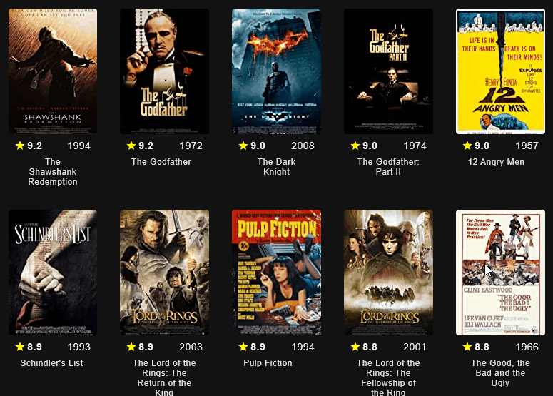

# imdb
## Projeto do Desafio 7 Days of Code Kotlin alura

### Objetivo

Utilizando apenas código Kotlin, consumir uma API para pesquisar
os top 250 filmes da lista do IMDB e criar uma aplicação Desktop
(utilizando o Compose Desktop) com os resultados JSON devolvidos.

#### Resultado final

#7DaysOfCode #feedback7DoC #kotlin #compose